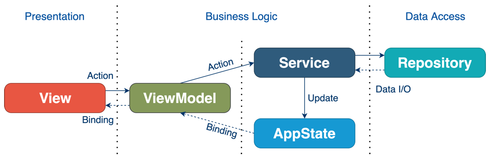

#  IDNow - Technical test

*I know, it's not really pretty, but I've choosen to spent more time on features and test than a pretty app. With some more work, I could highly improved it, but I think I showed my skills here*

i've spent **~10 hour on this technical test**. **~4 hours on the architecture**, **~3 hours on the front**, **~3 hours on the unit test + architecture of the unit test**.

This project is mainly created in the MVVM - Clean architecture.
To start, here is a representation of the basic architecture.

The main thing to understand here is that every components have a very specific use, and all the components must NOT interfere with each others. 

+ View : The view must only be resposible of the front elements of the UI. The only way it must interact with something is through the ViewModel. 
+ ViewModel: The ViewModel  is performing if handling all the logic linked to the view. It might be usefull to handle animation, Service calls, native link, routing, etc
+ Service: The service is the most important part of the application. It's the heart of the communication between the front and the IO. All the API/DB/Mock/Cache/etc works is starting here. It must NOT call the API directly, but it must call all the repositories and work with them. *For example, the Service can call the API, store the result in the local Database, and add it to a cache. It can later find out if the API needs to be re-called dependeing of the cache and the local DB, etc...*
+ Repository: The repositories are the link to the outside world of the application. Any call to an API, a Database, a cache, etc must be added in the repository.

## How to use it

For this demo, i've created 
+ `ApiTreasureHuntRepository` for the demo of a server communication that i'm NOT using. 
+ `FakeTreasureHuntRepository` where I've faked the API response of a server. 

Tomorrow, if you wants to add a page, modify an existing view, here is how the class and the object are named : 

1) In the `core` directory, you have an `AppEnvironment` class that is created when the application is started. The `AppEnvironment` class is responsible to create all the DI, the Services and the Repositories.
2) We have an `ApiClientRepository` that is an abstract class of a ApiClient. If you want to create a specific Api Repository, you MUST override `ApiClientRepository` and add it in the `AppEnvironment`
3) Everytime you create a new module (remember, a feature IS a module), you MUST create 
   1) A `{MyNewModule}Service`
   2) A `{MyNewModule}repository` **IF NEEDED** (1 repository = 1 IO. An APIClient doesn't need to be created for every module)
   3) `ViewModel`, `View`, `Screen` and `Model` directories. 
4) Once this module and all the files are created, you can add the module in the `AppEnvironment` class and the DI will do the rest. 

The main files to look if you wants to see how it works are the following : 
+ `TreasureHuntService`
+ `TreasureHuntRepository`
+ `TreasureHuntScreen`

## Unit Tests

For this demo, I've only added screen test and I'm using the librairy [ViewInspector](https://github.com/nalexn/ViewInspector). 
ALL our `Services`/`Repository` are abstract and can be override with some Mocked/Stub datas. In the purpose of this demo, I've created a `MockedTreasureHuntService` that is used in the `test_treasureHunt_loaded` function. 

Basicaly, everytime you create a test, you can override the service with a `Mock` one that is gonna compare the waited result and the real result.
I haven't used it that much in this demo, but I've showed how to use it, and added it to the architecture.  

I've tested 2 views : The `TreasureHuntScreen` and the `TreasureHuntDetailView`. 

## Improvements

I could have make a LOT of improvements on this technical tests, but I'm lacking time, and it might be a lot to review. I would love to talk about it in real life, and how I could do it. 
+ **Improve the UI:**  Right now, the UI is not really pretty, but I don't think spending hours on pretty UI is gonna make a huge difference to show my skills.
+ **Add dynamic routing:** Everything is one one page, I could add a routing architecture to handle multiPage treasure
+ **Improve the thread management on the repositories:** Right now, the repositories answer on the `DispatchQueue.main` thread. I could add a specific thread for every repositories
+ **Stub the system calls:** For testing purpose, we might want to test that the users doesn't have notifications enabled, or that the system is in dark mode, or some Deeplinkings. I could add an abstract protocol that I could stub in the Unit tests (or even in debug mode)
+ **Improve the architecture:** There might be a lot of place where the architecture and the abstraction might be improved, to prevent pasting code

